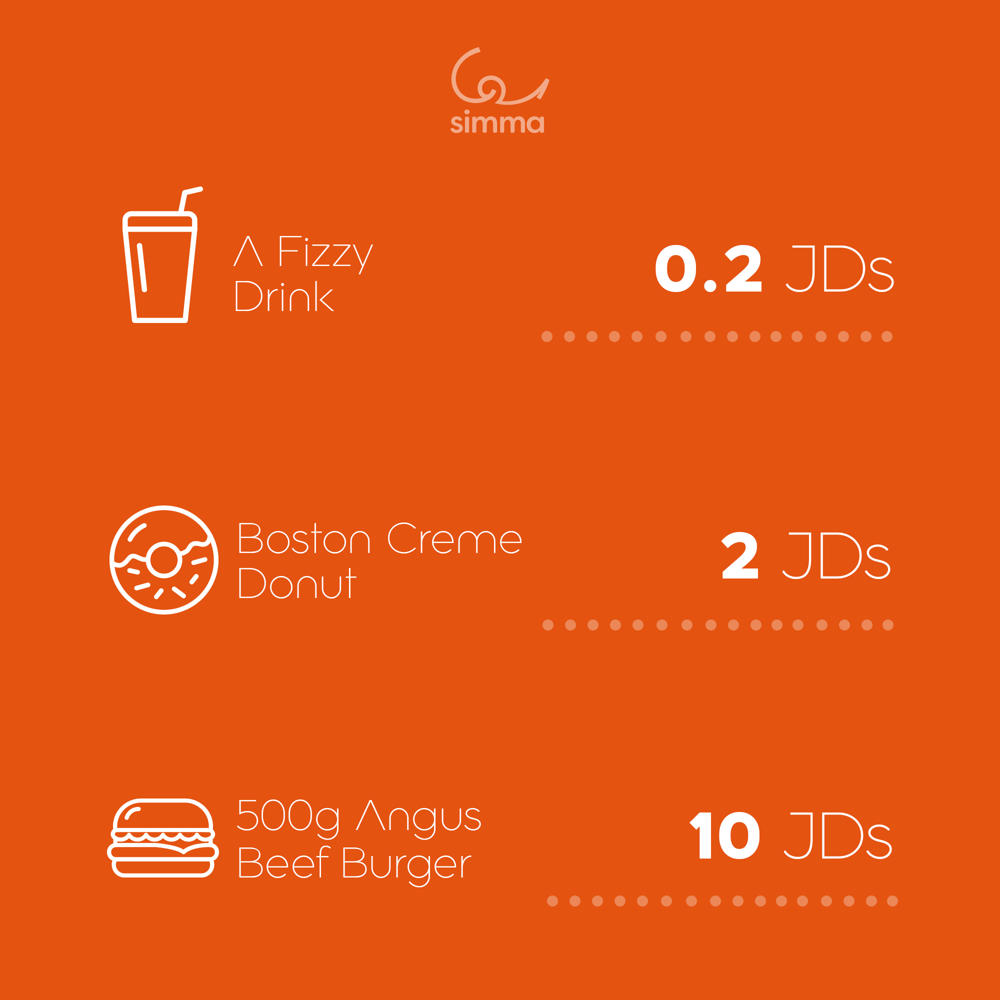
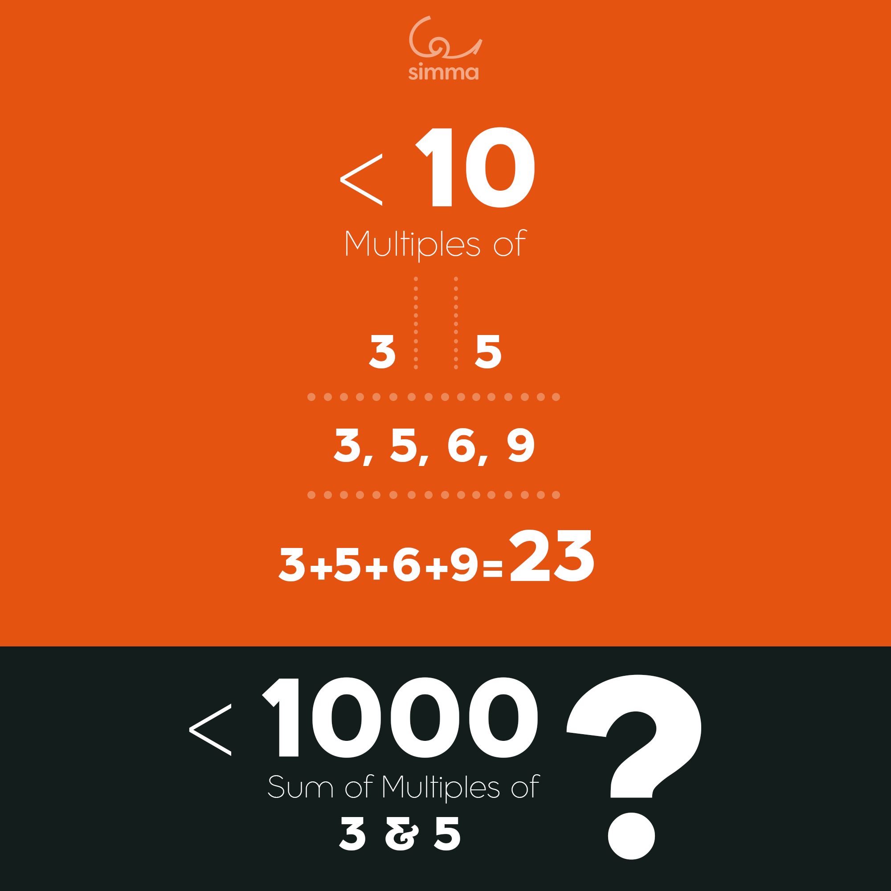

# Problem Solving

**This repo created to solve two questions from [Simma](https://www.simma.io/) Company**
   

<h3> 1st Question: </h3>

You're at a friend’s wedding, who seems to be a cheap friend! Anyway, there are 200 attendees and he only has 200 JDs in his pocket. 

The groom (العريس) asks you to:

i. Every single attendee needs to get an item, and you should buy at least a single item from every single item on the menu.

ii. And to spend exactly 200 JDs.

<h2 style="margin-left: 170px; text-weight:bold; color: orange"> Menu</h2>

  

<h2 style="text-weight:bold; color: orange"> Solutions</h2>

* [Question 1 using Java](solutions/java/Question1.java)
* [Question 1 using Python](solutions/python/question1.py)
* [Question 1 using JavaScript](solutions/javascript/question1.js)

   

<h3> 2nd Question </h3>

If we list all the natural numbers below 10 that are multiples of 3 or 5, we get:

3, 5, 6 and 9 >>>

If we add them up, the sum of these multiples is 23.

Find the sum of all the multiples of 3 or 5 below 1000.

<h2 style="margin-left: 150px; text-weight:bold; color: orange">Explination</h2>

<h2 style="text-weight:bold; color: orange"> Solutions</h2>

* [Question 2 using Java](solutions/java/Question2.java)
* [Question 2 using Python](solutions/python/question2.py)
* [Question 2 using JavaScript](solutions/javascript/question2.js)
